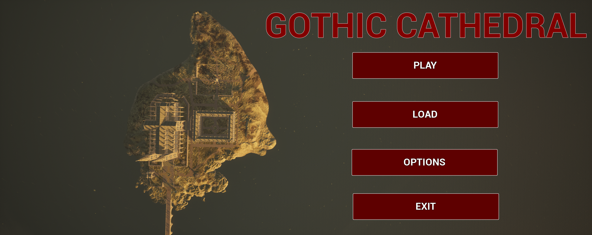
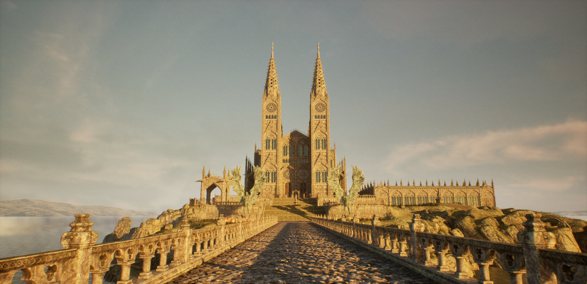
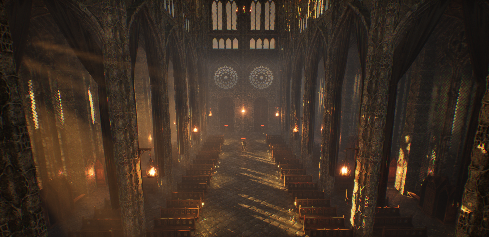
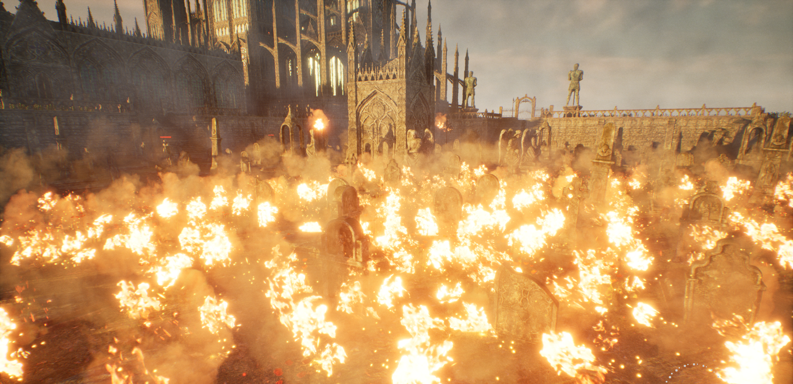
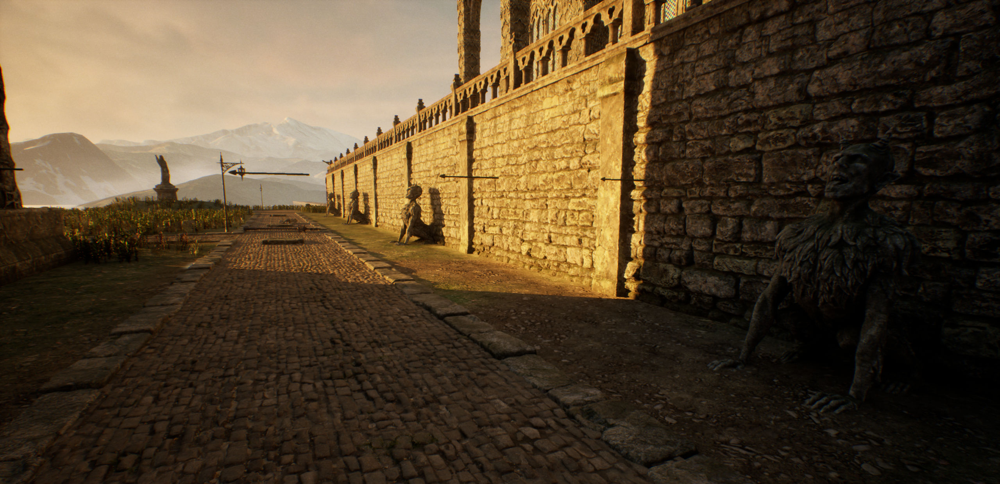
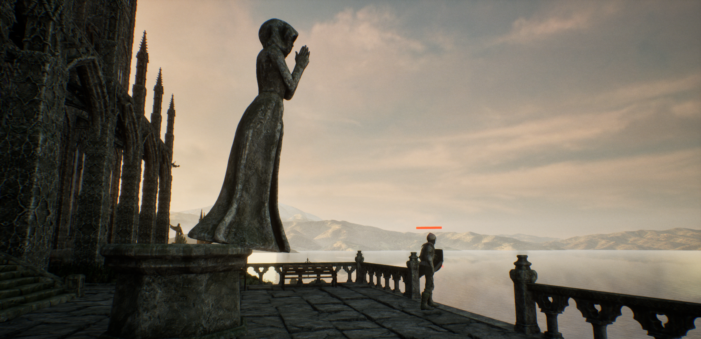

# Gothic Cathedral
 
Final year university Unreal Engine project.

(Ignore if it asks for feedback, as it was for the assignment)

----- If loading screen takes too long or game crashes -----
Exit the program (Alt F4 if needed) and go to: C:\Users\User\AppData\Local\SynopticProject\Saved and delete the .upipelinecache file

Credits:

Buxoided (2022) Skeleton Knight Modular [3D asset]. Available at: https://www.fab.com/listings/fc3a309a-a3eb-46de-bebe-dcb40dc31e48

MichalSornat (2023) UCreate - Gothic Cathedral Asset Pack [3D asset]. Available at: https://www.fab.com/listings/aa08c781-83d6-493c-ac4c-48f177fb66a6

StanislavGeivah (2022) Ancient Golem [3D asset].Available at: https://www.fab.com/listings/211cded8-631a-4d3f-ad1f-e94e09cfa8e6 (Accessed: 10 March 2025)

